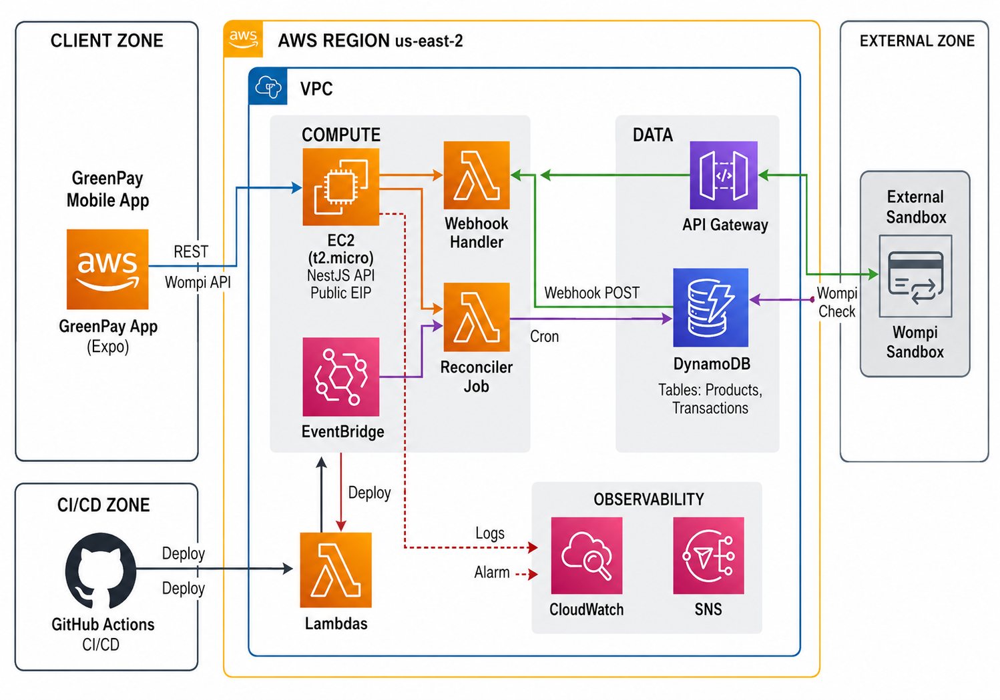

# Credit Card Checkout — Backend API

REST API built with **NestJS 11** + **TypeScript** following **Hexagonal Architecture** (Ports & Adapters). Manages product catalog, credit card transactions, and integrates with an external payment gateway (sandbox).

## Tech Stack

| Technology | Version | Purpose |
|---|---|---|
| NestJS | 11.x | API framework |
| TypeScript | 5.x | Type-safe language |
| Swagger | @nestjs/swagger | OpenAPI docs at `/api/docs` |
| DynamoDB | - | NoSQL database (AWS) |
| Jest | 29.x | Unit testing (>80% coverage) |
| Docker | - | Containerization |

## Architecture

```
src/
├── domain/                  # Business logic — zero dependencies
│   ├── entities/            # Product, Transaction, CardInfo
│   └── ports/               # Interfaces (IProductRepo, IPaymentGateway)
├── application/             # Use cases — orchestration layer
│   ├── use-cases/           # CreateTransaction, ProcessPayment, UpdateStock
│   └── dtos/                # Request/Response DTOs with validation
└── infrastructure/          # External world — adapters
    ├── database/            # DynamoDB adapter (implements ports)
    ├── payment/             # Payment API client (implements ports)
    └── http/                # NestJS controllers & middlewares
        ├── controllers/
        └── middlewares/
```

## API Endpoints

| Method | Path | Description |
|---|---|---|
| `GET` | `/api/products` | List all products with stock |
| `GET` | `/api/products/:id` | Get single product |
| `POST` | `/api/transactions` | Create transaction + process payment |
| `GET` | `/api/transactions/:id` | Get transaction status |

## Getting Started

### Prerequisites
- Node.js 22+
- npm 10+
- AWS CLI configured (or local DynamoDB)

### Install & Run
```bash
# Install dependencies
npm install

# Copy environment variables
cp .env.example .env

# Run in development
npm run start:dev

# Swagger UI → http://localhost:3000/api/docs

# Run tests
npm run test

# Run tests with coverage
npm run test:cov
```

### Docker
```bash
# Build image
docker build -t checkout-api .

# Run container
docker run -p 3000:3000 --env-file .env checkout-api

# Or with docker-compose
docker-compose up
```

### Seed products (DynamoDB)
```bash
# Requires AWS credentials and Products table
npm run seed:products
```

## AWS architecture

Diagrama de despliegue en **AWS us-east-2** (EC2 NestJS, DynamoDB, Lambda reconciler/webhook, API Gateway, EventBridge, CloudWatch/SNS, Wompi sandbox, GitHub Actions):



Detalle operativo: [`docs/aws-setup.md`](./docs/aws-setup.md).

## AWS deployment

Live API (Ohio): see [`docs/aws-setup.md`](./docs/aws-setup.md) for EC2, DynamoDB, Lambda, and GitHub Actions secrets.

```bash
# Manual redeploy 
rsync -avz --exclude node_modules --exclude dist --exclude coverage \
  -e "ssh -i ~/Downloads/greenpay-ec2.pem" \
  ./ ec2-user@18.224.46.220:~/backend/
ssh -i ~/Downloads/greenpay-ec2.pem ec2-user@18.224.46.220 \
  'cd ~/backend && docker compose up -d --build'
```

## Unit tests (Jest) — mandatory >80% coverage

Unit tests run with **Jest**. Business logic is covered via unit specs (entities, use cases, adapters, Lambda handlers, HTTP filter) with mocked ports/AWS/HTTP clients.

```bash
# Run all unit tests
npm test

# Run with coverage report
npm run test:cov
```

### Coverage results

Generated with `npm run test:cov` (Jest `--coverage`). **Requirement met: >80%.**

| Metric | Coverage |
|---|---|
| Statements | **99.27%** (682/687) |
| Branches | **86.28%** (283/328) |
| Functions | **99.14%** (116/117) |
| Lines | **99.39%** (653/657) |

```
=============================== Coverage summary ===============================
Statements   : 99.27% ( 682/687 )
Branches     : 86.28% ( 283/328 )
Functions    : 99.14% ( 116/117 )
Lines        : 99.39% ( 653/657 )
================================================================================
```

- **Test suites:** 26 passed  
- **Tests:** 146 passed  
- Coverage excludes Nest wiring barrels (`index.ts`), `*.module.ts`, and `main.ts` (DI bootstrap); all domain/application/infrastructure logic is included.

## Environment Variables

See `.env.example` for required configuration.

## License

Private — not for distribution.
